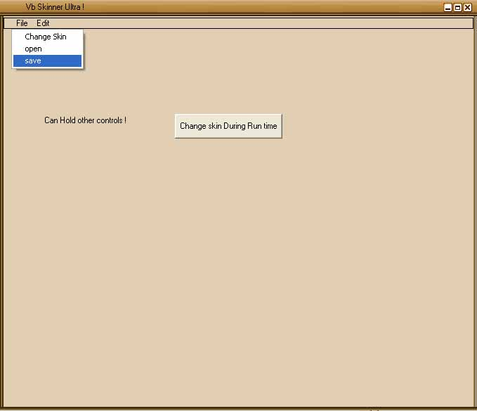



## VBskinner Ultra \!

### Description

The vbskinner ultra is reloaded with features! Lot of em! It supports menus, design time skinning, resizable, can remember last skin and a lot more. It&#8217;s really faster than the earlier version and now looks really cool. Thanks for all that suggestions that made me think about the code. I will keep updating it with new version. So now u can download this code! U will say that it&#8217;s cool!
 
### More Info
 

             |
---                |---
**Submitted On**   |2005-08-11 11:31:14
**By**             |[Rajeev Punnalil](https://github.com/Planet-Source-Code/PSCIndex/blob/master/ByAuthor/rajeev-punnalil.md)
**Level**          |Intermediate
**User Rating**    |3.8 (15 globes from 4 users)
**Compatibility**  |VB 5\.0, VB 6\.0
**Category**       |[Custom Controls/ Forms/  Menus](https://github.com/Planet-Source-Code/PSCIndex/blob/master/ByCategory/custom-controls-forms-menus__1-4.md)
**World**          |[Visual Basic](https://github.com/Planet-Source-Code/PSCIndex/blob/master/ByWorld/visual-basic.md)
**Archive File**   |[VBskinner\_1932459142005\.zip](https://github.com/Planet-Source-Code/rajeev-punnalil-vbskinner-ultra__1-62501/archive/master.zip)

